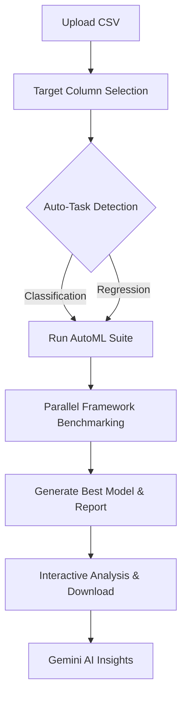

# AutoML Laboratory

[](https://www.python.org/)
[](https://flask.palletsprojects.com/)
[](https://opensource.org/licenses/MIT)

**AutoML Laboratory** is a comprehensive supervised learning benchmarking platform designed to automate the machine learning pipeline. It allows users to upload datasets, automatically detect task types, and benchmark multiple state-of-the-art AutoML frameworks simultaneously to find the best performing model.

---

## Key Features

- **Multiple Frameworks**: Benchmark top-tier AutoML libraries in one run:
  - **H2O AutoML**
  - **AutoGluon**
  - **TPOT** (Genetic Programming based optimization)
  - **FLAML** (Fast and Lightweight AutoML)
- **Auto Task Detection**: Automatically identifies whether your dataset requires **Binary Classification**, **Multiclass Classification**, or **Regression**.
- **Interactive Dashboard**: Visualize metrics through dynamic charts (powered by Chart.js) and comparison tables.
- **Gemini AI Analysis**: Integrated AI-powered results interpretation to help you understand *why* a model performed well.
- **Model Export**: Download optimized models and full synthesis reports (.json) for immediate deployment.
- **Secure Auth**: Full user management system with separate experiment tracking.

---

## Tech Stack

### Backend
- **Core**: Python, Flask
- **ML/AutoML**: H2O, AutoGluon, TPOT, FLAML, SciKit-Learn, XGBoost, LightGBM, CatBoost
- **Data**: Pandas, NumPy
- **Database**: SQLite (SQLAlchemy-free, raw optimized queries)

### Frontend
- **UI/UX**: HTML5, Vanilla CSS3 (Custom Glass-morphism design)
- **Viz**: [Chart.js](https://www.chartjs.org/) for performance metrics
- **Icons**: Lucide Icons / SVG-based assets

---

## Installation

### Prerequisites
- Python **3.10** or **3.11** (recommended)
- Git

### Setup Steps

1. **Clone the Repository**
   ```bash
   git clone https://github.com/YUK3SH/AutoML-LABORATORY.git
   cd AutoML-LABORATORY
   ```

2. **Create Virtual Environment**
   ```bash
   # On Windows
   py -3.10 -m venv venv
   .\venv\Scripts\activate
   ```

3. **Install Dependencies**
   ```bash
   pip install -r requirements.txt
   ```

4. **Environment Variables**
   Create a `.env` file in the root directory:
   ```env
   GEMINI_API_KEY=your_key_here
   ```

5. **Run the Application**
   ```bash
   python app.py
   ```
   Navigate to `http://127.0.0.1:5000` in your browser.

---

## Workflow



---

## Example Datasets

The repository includes curated datasets in the `uploads/` folder to get you started:
- `StudentsPerformance.csv`: Perfect for **Multiclass Classification** (predicting grades/scores).
- `WineQT.csv`: Ideal for **Regression** or **Classification** benchmarking.
- `data.csv`: A general-purpose dataset for quick testing.

---

## Testing

We use `pytest` for unit and integration testing. To run the test suite:

```bash
# Run all tests
pytest tests/

# Run with verbose output
pytest tests/ -v
```

---

## Project Structure

- `app.py`: Main Flask entry point and route definitions.
- `backend/`:
  - `runner.py`: Orchestrates the asynchronous AutoML execution flow.
  - `task_detector.py`: Logic for automated task type inference.
  - `metrics.py`: Custom metric calculators for complex evaluations.
  - `frameworks/`: Individual wrappers for each AutoML engine.
- `frontend/`:
  - `templates/`: Jinja2 HTML templates.
  - `static/`: Custom CSS, JS, and global assets.

---

## License

This project is licensed under the MIT License - see the [LICENSE](LICENSE) file for details.

---

## Contributing

Contributions are welcome! Please feel free to submit a Pull Request.

1. Fork the Project
2. Create your Feature Branch (`git checkout -b feature/AmazingFeature`)
3. Commit your Changes (`git commit -m 'Add some AmazingFeature'`)
4. Push to the Branch (`git push origin feature/AmazingFeature`)
5. Open a Pull Request

---
